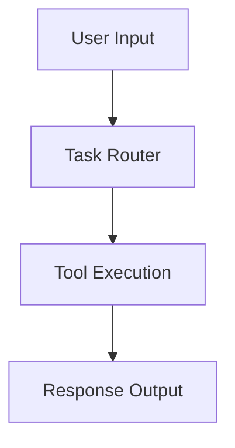

# 🚀 AI Developer Assistant using LangGraph + AWS Bedrock (Claude 3 Sonnet)

This project demonstrates how to build an **AI-powered developer assistant** using **LangGraph**, **LangChain**, and **AWS Bedrock (Claude 3 Sonnet)**.

It supports multiple developer tasks such as:

* Code generation
* Debugging
* Refactoring
* Code explanation

---

## 🧠 Features

* 🔧 Task-based routing using `Enum`
* 🧩 Tool execution via LangChain tools
* 🔄 Workflow orchestration using LangGraph
* 🤖 Claude 3 Sonnet integration via AWS Bedrock
* ⚡ Modular and extensible architecture

---

## 📁 Project Structure

```
.
├── main.py          # Core implementation
├── README.md        # Documentation
```

---

## ⚙️ Supported Tasks

| Task Type           | Description               |
| ------------------- | ------------------------- |
| GENERATE_CODE       | Generate code from prompt |
| DEBUG               | Debug existing code       |
| AUTO_COMPLETE       | Complete partial code     |
| GENERATE_DOCS       | Generate documentation    |
| COMMIT_CHANGES      | Suggest commit messages   |
| REFACTOR            | Improve code structure    |
| EXPLAIN_CODE        | Explain given code        |
| CODE_QUALITY_REVIEW | Review code quality       |

---

## 🌐 Supported Languages

Includes support for:

`Python`, `JavaScript`, `TypeScript`, `Java`, `C++`, `C#`, `Go`, `Rust`, `SQL`, `HTML`, `CSS`, `Shell`, `PowerShell`, and more.

---

## 🏗️ Architecture



---

## 🧩 Core Components

### 1. Task & Language Enums

Defines structured input for task handling and language selection.

### 2. Tools

Custom tools implemented using LangChain:

* `explain_code`
* `generate_code`
* `refactor_code`
* `debug_code`

### 3. LangGraph Workflow

* Entry point: `tool_router`
* Executes appropriate tool based on task type
* Returns structured output

### 4. AWS Bedrock (Claude 3 Sonnet)

Used as the LLM backend for intelligent responses.

---

## 🚀 Getting Started

### 1. Install Dependencies

```bash
pip install langchain langgraph boto3
```

---

### 2. Configure AWS Credentials

Make sure your AWS credentials are set:

```bash
aws configure
```

Ensure access to **Bedrock model**:

* `anthropic.claude-3-sonnet-20240229-v1:0`

---

### 3. Run the Application

```bash
python main.py
```

---

## 🧪 Sample Input

```python
result = ai_dev_graph.invoke({
    "task_type": TaskType.EXPLAIN_CODE,
    "input": "def add(a, b): return a + b"
})
```

---

## 📤 Sample Output

```
Explanation of the code:
def add(a, b): return a + b
```

---

## 🔮 Future Enhancements

* ✅ Add multi-step agent workflows
* ✅ Integrate RAG for codebase understanding
* ✅ Add UI using Streamlit
* ✅ Support multi-language execution
* ✅ Code quality scoring & linting

---

## 🤝 Contributing

Feel free to fork this repo and contribute improvements 🚀

---

## 📜 License

This project is licensed under the MIT License.

---

## 💡 Author

Pavan Tatikonda Built using LangGraph, LangChain, and AWS Bedrock.
